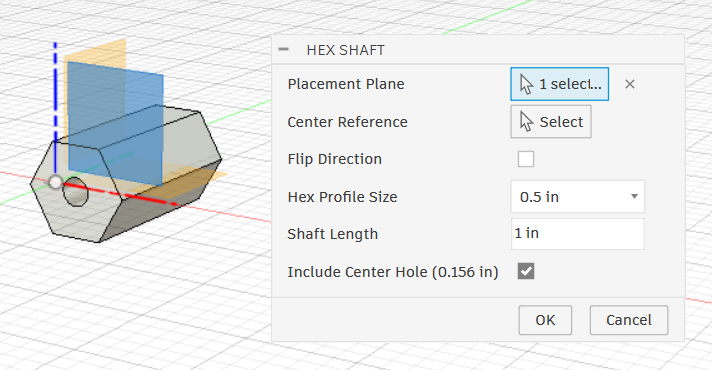
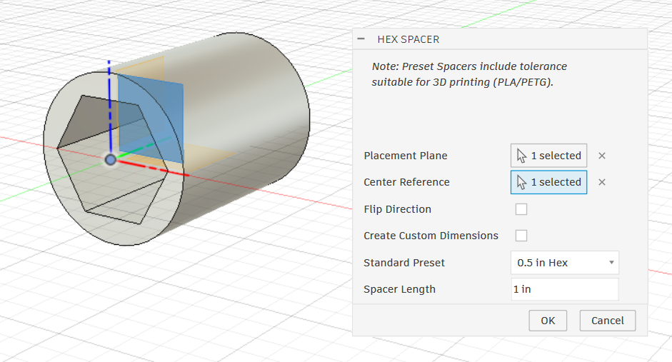

## Generate vendor shafts and spacers instantly 
[Download Latest](https://github.com/cyberius-6017/FRC-Shafts-for-Fusion/releases/latest){: .btn}

---

## Installation Guide

1. Download the latest `.zip` file from the Releases page.
2. Extract the folder to your Autodesk Fusion Add-ins directory (Usually any folder works).
3. Open Autodesk Fusion and navigate to **Utilities > ADD-INS > Scripts and Add-ins**.
4. Select the **Add-Ins** tab and click the green **+** icon.
5. Select **Script or add-in from device**.
6. Select the extracted folder.
7. Activate the **Run on Startup** checkbox.
8. Click the **Run** toggle.

---

## Current version includes:

### Vendor Shaft generator:
For Max Spline, Spline XL, Round Hex & others.

### Hex Shaft generator: 
With presets for drilled 0.5 & 0.375.

### Hex Spacer generator: 
With preset tolerances for 3D printing.

### Round Spacer generator: 
With presets for #10-32 bolts and other common hardware.

[Download Latest](https://github.com/cyberius-6017/FRC-Shafts-for-Fusion/releases/latest){: .btn}
